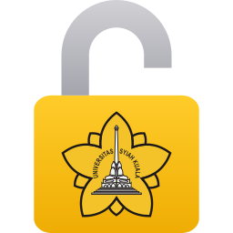

# SIMKULIAH Login Bot Chrome Extension

    

 

**SIMKULIAH Login Bot Extension** is a Google Chrome browser extension that helps users log in to the **SIMKULIAH** system automatically.

This extension can:
- Fill in the **NPM**
- Fill in the **password**
- Retrieve the **captcha**
- Send the captcha to the **OCR API**
- Auto-fill the captcha results
- Perform **automatic login**

This extension was created to simplify the login process, which usually requires manual captcha input.

## How to Install

1. Download the `.crx` extension file.
    [Download here](https://github.com/naufalhanif25/simkuliah-login-bot-chrome-ext/raw/refs/heads/main/extensions/chrome/simkuliah-login-bot-chrome-ext.crx)
2. Open the extension page in Chrome:
    `chrome://extensions`
3. Enable **Developer Mode** in the top right corner.
4. Drag & Drop the `.crx` file to the page.
5. Click **Add Extension**.

## How to Use

1. Open the **SIMKULIAH** login page.
2. Click the **SIMKULIAH** Login Bot Extension icon in the Chrome toolbar.
3. Enter:
    - User ID (NPM)
    - Password
4. Click the Login button.
5. The extension will:
    - Retrieve the captcha
    - Send it to the API
    - Fill in the captcha
    - Automatically log in.